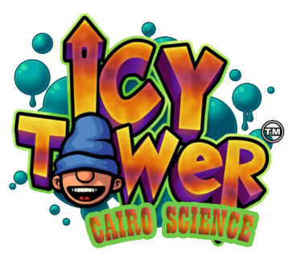
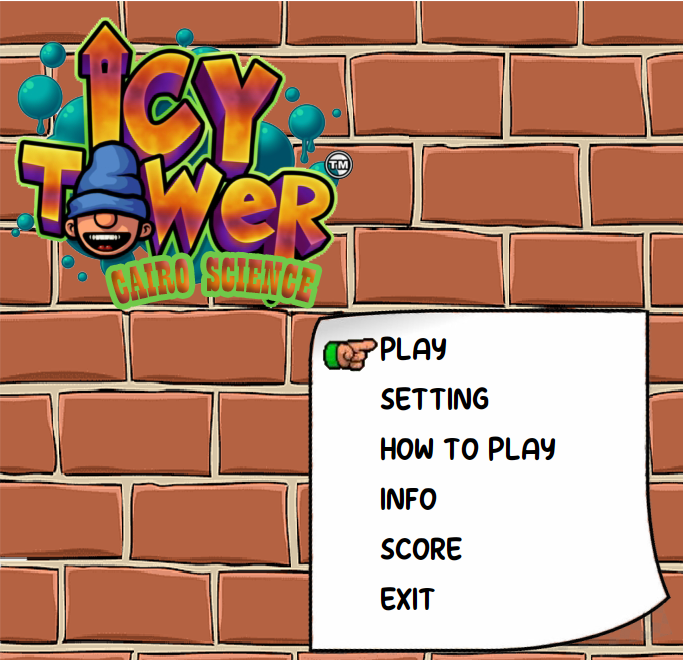
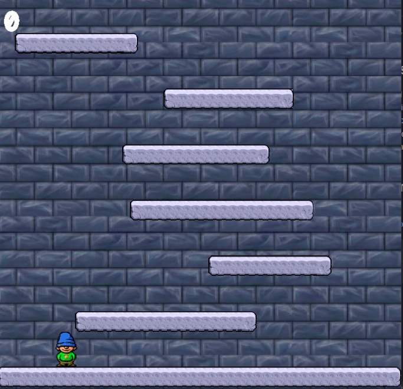
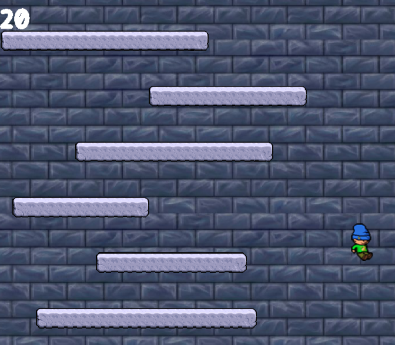
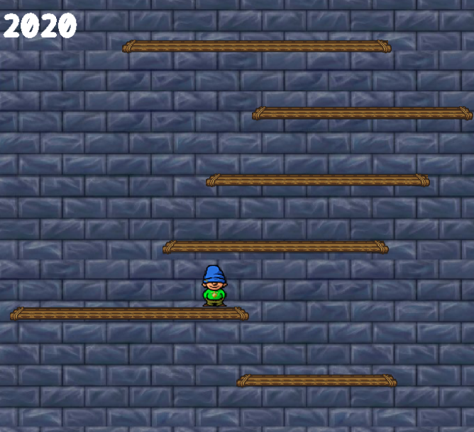

# Rebuild Classic Icy Tower Game using OpenGL and Java



## Overview

This project is a modernized rebuild of the classic "Icy Tower" game using OpenGL for graphics and Java as the programming language. The game retains the original gameplay mechanics, where players control a character jumping up an endless tower, trying to reach as high as possible while avoiding falling off the screen.

## Table of Contents
- [Overview](#overview)
- [Game Description](#game-description)
- [Screenshots](#screenshots)
- [How to Run](#how-to-run)
- [Resources](#resources)
- [Collaborators](#collaborators)
- [Technologies Used](#technologies-used)
- [Project Purpose](#project-purpose)
- [Contact Information](#contact-information)
- [License](#license)

## Game Description

### Gameplay
In "Icy Tower," the player controls a character who jumps up an endless series of platforms inside a tower. The objective is to climb as high as possible without falling. Points are scored based on the height reached and performing tricks such as combos and high jumps.

### Features
- **Classic Gameplay**: Faithfully recreates the addictive mechanics of the original game.
- **Enhanced Graphics**: Utilizes OpenGL for improved graphics and smoother animations.
- **Sound Effects and Music**: Incorporates audio to enrich the gaming experience.
- **Score System**: Keeps track of player performance and displays high scores.

## Screenshots

Here are some screenshots from the game:


*Main menu for the game*


*Game screen*


*Character jumping on platforms*


*Game has different floors depending on score*

## How to Run

### Prerequisites
- **Java Development Kit (JDK)**: Ensure that JDK 8 or higher is installed on your machine.

### Steps to Run
1. **Clone the Repository**:
    ```sh
    git clone https://github.com/Mahmoudbakar2002/IcyTowerGame.git
    ```
2. **Navigate to the Project Directory**:
    ```sh
    cd IcyTowerGame
    ```
3. **Copy OpenGL Libraries**:
   - Copy the `JOGLWin` folder to the root of your C drive (`C:\`).
4. **Compile the Source Code**:
    ```sh
    javac -cp lib/* src/*.java -d out
    ```
5. **Run the Game**:
    ```sh
    java -cp out:lib/* Main
    ```

## Resources

### Code Repository
- [GitHub Repository](https://github.com/Mahmoudbakar2002/IcyTowerGame)

### Documentation
- [OpenGL Documentation](https://www.opengl.org/documentation/)
- [Java Documentation](https://docs.oracle.com/en/java/)

### Tutorials
- [GitHub Tutorial](https://www.youtube.com/watch?v=Q6G-J54vgKc)

### Materials
- [Character Sprites](http://www.icytower.unas.cz/down2.htm)

## Collaborators

- **Mahmoud Atef**: [mahmoudAtef.coder@gmail.com](mailto:mahmoudAtef.coder@gmail.com)
- **Mohamed Atef Shata**: [mohamedshata9898@gmail.com](mailto:mohamedshata9898@gmail.com)

## Technologies Used

- **Programming Language**: Java
- **Graphics Library**: OpenGL
- **IDE**: IntelliJ IDEA
- **Java Libraries**: JOGL, Swing

## Project Purpose

This project was developed as part of a faculty assignment aimed at integrating computer graphics with game development. The goal was to demonstrate the application of OpenGL in creating interactive and visually appealing games, alongside reinforcing object-oriented programming skills in Java.

## Contact Information

For further information, you can reach out to the project maintainers via email or visit our [GitHub Repository](https://github.com/Mahmoudbakar2002/IcyTowerGame).

---

Thank you for exploring our project! We hope you enjoy playing our version of the classic "Icy Tower" game.

---

## License

This project is licensed under the MIT License - see the [LICENSE](LICENSE) file for details.
